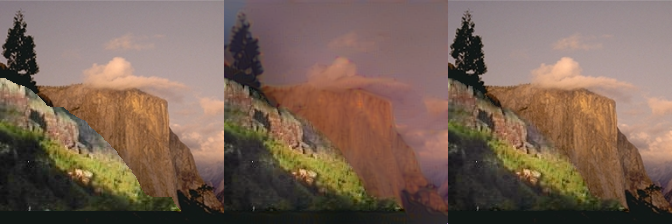
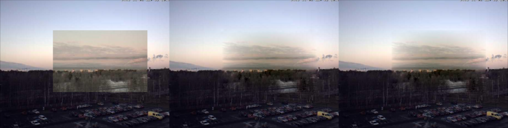

# chainer-realismCNN
Chainer implementation for realismCNN proposed in [Learning a Discriminative Model for the Perception of Realism in Composite Images](http://efrosprojects.eecs.berkeley.edu/realism/index.html).

## Download pretrained caffe model
1. Download [pretrained caffe model](http://efrosprojects.eecs.berkeley.edu/realism/realismCNN_models.zip).
2. Run `python load_caffe_model.py` to transform pretrained caffe model into **Chainer** model.

## Predict image's realism
1. Download dataset [Realism Prediction Data](http://efrosprojects.eecs.berkeley.edu/realism/human_evaluation.zip).
2. Run `python mat2list_human_eval.py` to obtain image list & ground truth.
3. Run `python predict_realism.py` to obtain prediction results. **AUC** score will be printed out, prediction score for each image will be stored in plain text file.

## Image Editing towards generating more realistic composited images
1. Download dataset [Color Adjustment Data](http://efrosprojects.eecs.berkeley.edu/realism/color_adjustment.zip).
2. Run `python mat2list_image_editing.py` to obtain image list.
3. Run `python image_editing.py` to obtain more realistic images. (cut_and_paste image, generated image) will be saved in the `result` folder, and a plain file will be generated recording (cut_and_paste loss, generated loss) for each image.

## Results
### `python image_editing.py`

### `python poisson_image_editing.py`

### `python modified_possion_image_editing.py`

### `python image_blending_with_gan.py`
_poisson_weight(1)_rand_init(True)_tv_weight(0.005).png)
_poisson_weight(1)_rand_init(True)_tv_weight(0.005).png)
_poisson_weight(1)_rand_init(True)_tv_weight(0.005).png)
_poisson_weight(1)_rand_init(True)_tv_weight(0.005).png)
_poisson_weight(1)_rand_init(True)_tv_weight(0.005).png)
_poisson_weight(1)_rand_init(True)_tv_weight(0.005).png)

## NOTE
* Run `python [SCRIPT_NAME].py -h` for more options.
* Download converted Chainer VGG-19 model from [here](https://drive.google.com/open?id=0Bybnpq8dvwudM0U3enFsYV9waWM).
* If you want to download Transient Attributes Dataset, please see [the project website](http://transattr.cs.brown.edu/) for more details
